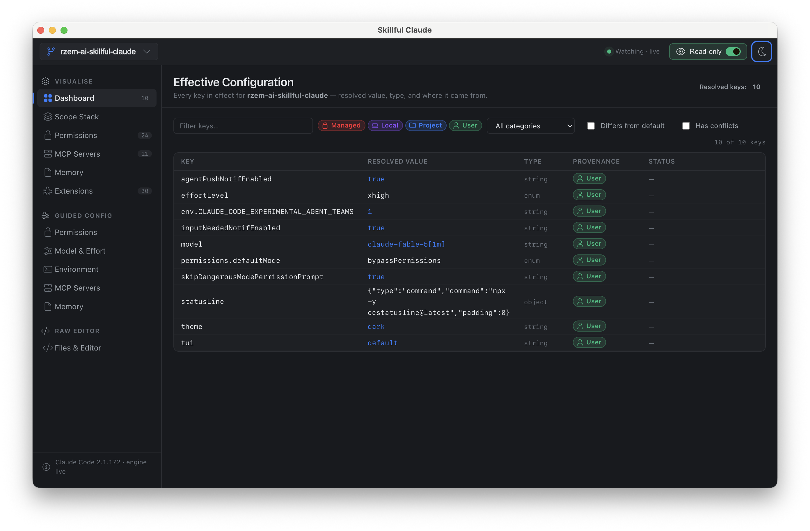
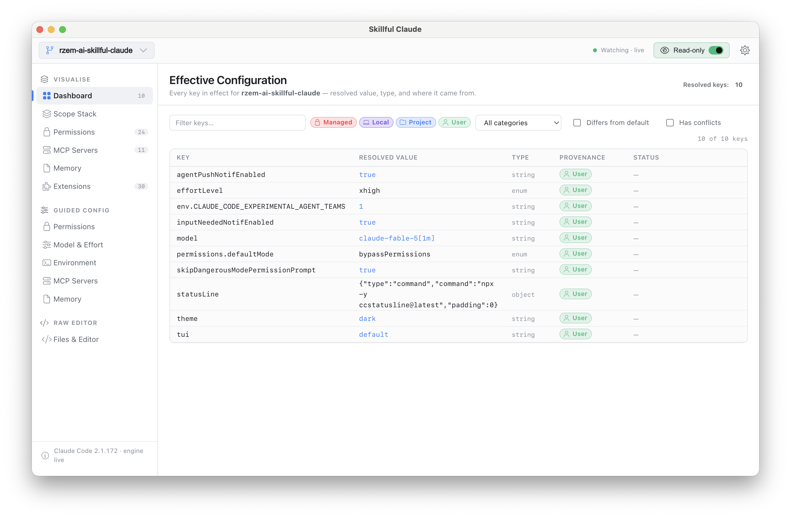
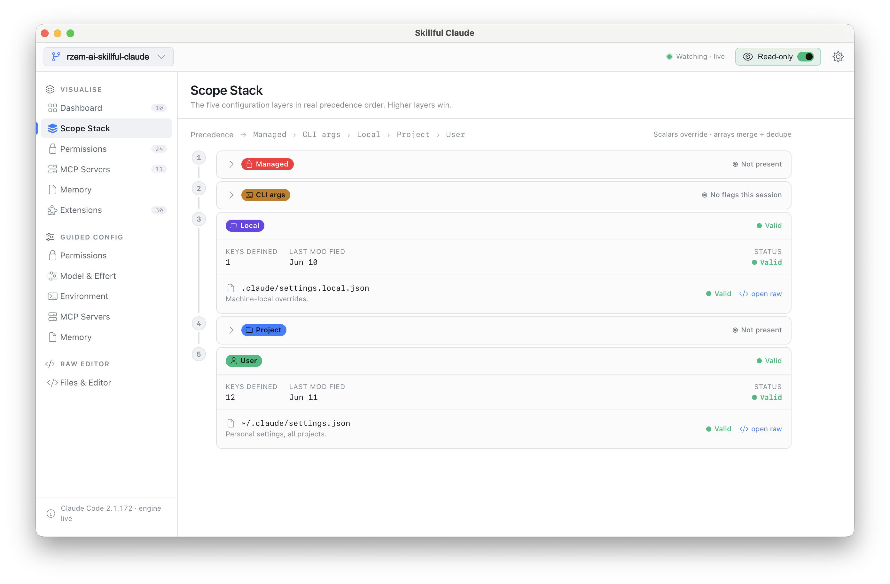
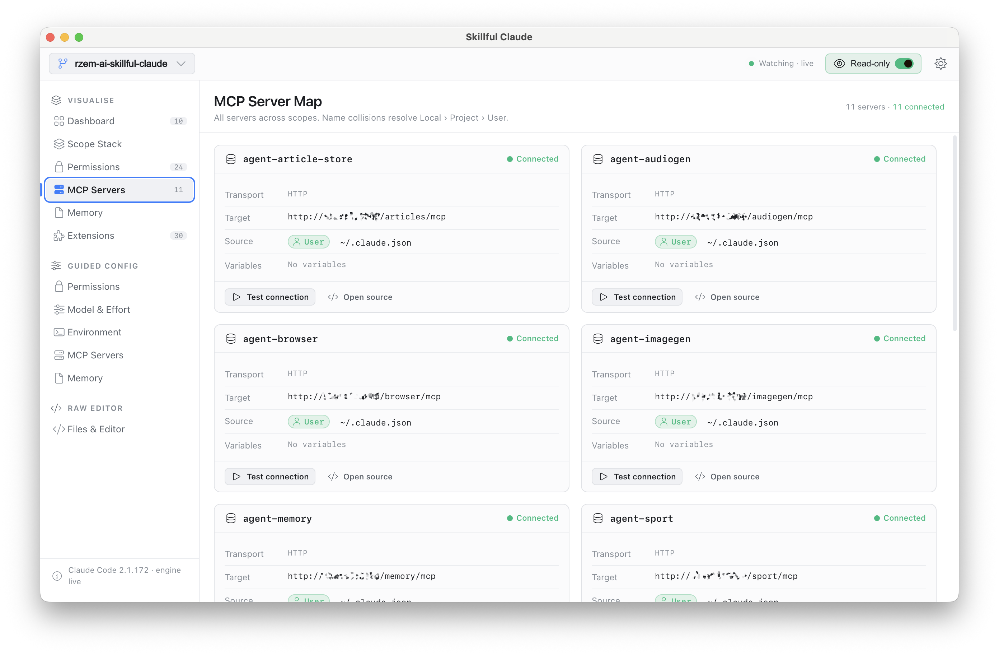
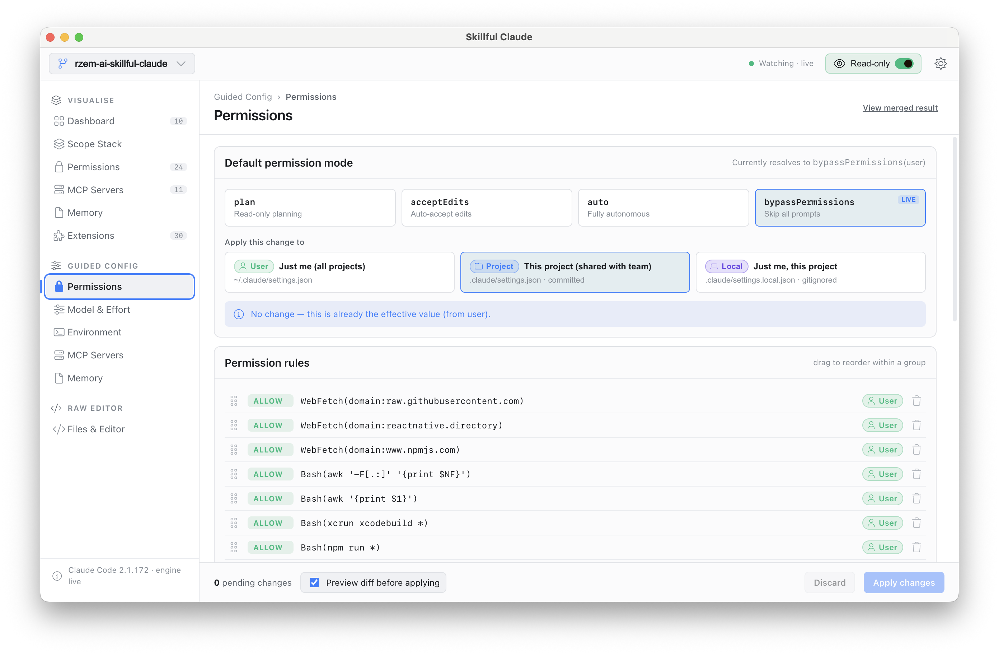
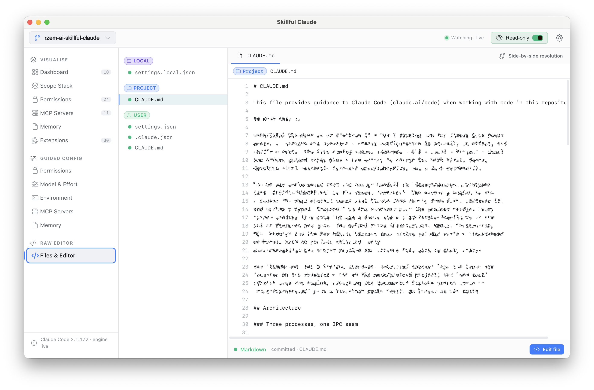
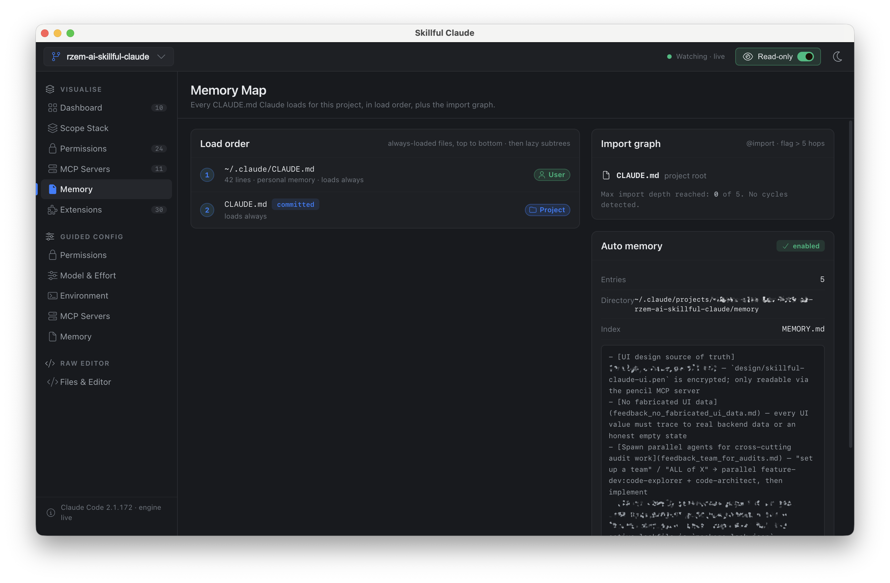

<div align="center">

# Skillful Claude

**What Claude Code configuration is actually in effect — and why.**

A desktop diagnostic for Claude Code's five config scopes.
Trace every setting to the file that won, see what got overridden, and change
config without guessing what the merge will do.



</div>

---

## The problem

Claude Code configuration is spread across **five scopes** — Managed › CLI ›
Local › Project › User — a dozen files, and a set of merge rules that live only
in the docs and the source. When the agent behaves unexpectedly, the question
is never *"what did I write?"* It's:

> **"What configuration is actually in effect, and why?"**

Skillful Claude answers that question. The app reads every Claude Code config
file on your machine, replicates Claude Code's real resolution rules — scalar
override, array merge, the auto-mode rule, global-config-key routing, managed
locks — and shows you the **effective configuration with full provenance**.
Every value on screen carries a scope chip and a source file. File watchers
keep it live: edit a `settings.json` in your editor and the app updates in
place.

## See your config

### Dashboard

One screen that tells you what's in effect right now: the resolved model,
permission posture, environment, MCP servers, and memory files — each value
chipped with the scope that won.



### Scope Stack

The full merge, laid bare. Every key, every scope that defines it, and which
one won — overridden values stay visible instead of silently disappearing.
This is the screen you open when two files disagree.



### Permissions, MCP Map, Memory Map, Extensions

Dedicated read views for the config that matters most:

- **Permissions** — the merged allow/deny/ask rules across all scopes, with the
  source of each rule.
- **MCP Map** — every MCP server Claude Code will load, where it's declared,
  and what shadows what.
- **Memory Map** — the `CLAUDE.md` hierarchy (user, project, local) as Claude
  Code actually assembles it.
- **Extensions** — the installed plugins, skills, agents, and commands
  inventory.



## Change your config

### Guided forms

Five guided editors — **Permissions, Model, Environment, MCP, Memory** — that
know the rules so you don't have to. Each one writes to the correct file for
your chosen scope, refuses invalid placements, and shows you a diff **before**
anything touches disk. Not just the file diff, either: the diff of the
*resolved* configuration — what Claude Code will actually see after the merge.



### Raw Editor

A Monaco-powered editor over the real files, with the full scope file tree,
line-level lints, and secret masking. For when you know exactly what you want
to type — still guarded by the same write pipeline as the guided forms.



## Built to be trusted

This app edits the files that control your AI tooling, so the guardrails are
the product:

- **Honest data only.** Every value traces to a real file on disk or an
  explicit empty state. Nothing is fabricated, ever.
- **Atomic writes.** Temp-file + rename, never a partial write.
- **Automatic backups.** Timestamped, five retained per file.
- **A write-target resolver** that refuses managed scopes and invalid
  placements outright.
- **Secrets masked** everywhere they appear — tokens and keys never render in
  the clear.
- **Read-only mode.** One toggle and the app cannot write at all.
- **Managed is observed, never written.** The app explains org policy; it does
  not fight it.

Light theme included, but it was designed dark-first — dense and quiet, in the
spirit of Linear, Tower, and TablePlus.



## Install

Grab the latest build for your platform from
[**Releases**](https://github.com/rzem-ai/rzem-ai-skillful-claude/releases):

| Platform | Format |
| --- | --- |
| macOS | `.dmg` (Intel + Apple Silicon) |
| Linux | AppImage, `.deb`, `.rpm` |
| Windows | NSIS installer (x64) |

Or build from source:

```bash
git clone https://github.com/rzem-ai/rzem-ai-skillful-claude.git
cd rzem-ai-skillful-claude
npm install
npm run package   # distributables land in ./dist-builds
```

## Development

Electron 33 + Vue 3 + TypeScript, built with electron-vite. The config engine
(`electron/main/engine/`) is pure, Electron-free logic with a Vitest suite
asserting the documented ground truth in [`docs/fixtures.md`](./docs/fixtures.md).

```bash
# Full desktop dev loop (electron-vite spawns main + preload + renderer
# with HMR for the renderer). Renderer dev server is on port 1420.
npm run dev

# Type-check then build all three bundles into ./out
npm run build

# Type-check only (vue-tsc on the renderer + tsc on the main process)
npm run typecheck

# Run the engine test suite (Vitest)
npm test

# Package distributables for the current host into ./dist-builds
npm run package

# Per-platform variants
npm run package:linux    # AppImage, deb, rpm
npm run package:mac      # dmg (x64 + arm64)
npm run package:win      # nsis x64
```

`npm run typecheck` runs vue-tsc on `tsconfig.web.json` plus tsc on
`tsconfig.node.json`. `npm test` asserts the fixture ground-truth in
[`docs/fixtures.md`](./docs/fixtures.md) plus a live-host smoke test. There is
no linter or e2e suite.

See [`CLAUDE.md`](./CLAUDE.md) for architecture notes and
[`VISION.md`](./VISION.md) for product direction and the post-v1 roadmap.

## Releasing

`electron-builder` publishes to GitHub Releases at
`rzem-ai/rzem-ai-skillful-claude`. To ship a build:

1. Bump `version` in `package.json`.
2. Run `npm run release` (builds, packages, and publishes).
3. CI must have `GH_TOKEN` set to a token with `repo` scope.

In-app auto-update (`electron-updater`) was removed in the strip; re-add it
when the new version needs it. Don't run `npm run release` from a fork — it
will publish to the wrong repo.

## Recommended IDE setup

[VS Code](https://code.visualstudio.com/) with the
[Vue - Official](https://marketplace.visualstudio.com/items?itemName=Vue.volar)
extension.
